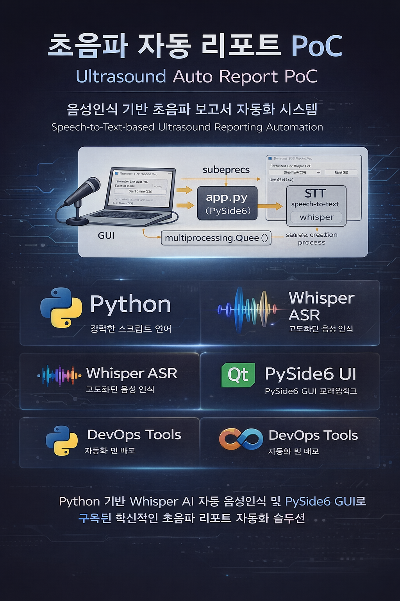

# 초음파 진단 구술 기반 자동 리포팅 PoC — 개발/디버깅 진행 기록 (Windows)



> 목적: **Windows PC 앱(PySide6)**에서 **마이크 음성 → STT(Whisper) → 용어 보정 → 구조화 → 리포트 생성**까지 PoC를 구현하고,  
> 특히 **한/영 혼용 의학용어(약 30개)**를 높은 정확도로 표기/구조화하는 파이프라인을 만든다.

---

## 0. 환경/전제

- OS: Windows 10/11
- Python venv: `.venv`
- UI: **PySide6**
- STT: **faster-whisper**(Whisper + CTranslate2)
- Audio: **sounddevice**
- 로컬 저장: JSON / 텍스트 / 세션 폴더

---

## 1. 최초 실행 단계에서 발생했던 문제들(Import/의존성)

### 1) PySide6 `QShortcut` ImportError
**증상**
```
ImportError: cannot import name 'QShortcut' from 'PySide6.QtCore'
```

**원인**
- `QShortcut`은 `QtCore`가 아니라 `QtGui`에 있음.

**조치**
- `from PySide6.QtGui import QShortcut` 또는 `QKeySequence, QShortcut`로 수정.

---

### 2) `requests` 누락으로 faster-whisper import 실패
**증상**
```
ModuleNotFoundError: No module named 'requests'
```

**원인**
- `faster-whisper` 내부에서 모델 다운로드/유틸에 `requests` 필요.

**조치**
- `pip install requests` 또는 requirements에 포함.

---

### 3) HuggingFace Hub 경고 (토큰/심볼릭 링크)
**증상**
- `HF_TOKEN` 미설정 경고
- Windows에서 symlink 미지원 경고(Developer Mode / 관리자 권한 필요)

**의미**
- 실행 자체는 가능하지만:
  - 다운로드 rate limit / 속도에 영향
  - 캐시가 디스크를 더 사용할 수 있음

---

## 2. “창이 안 뜨거나 바로 종료” / Access Violation(-1073741819) 문제

### 1) 앱 실행 시 즉시 종료(창 없음)
- 초기에 모델 로딩/스레드 시작 등에서 예외 또는 네이티브 크래시 가능성이 높았음.
- `python -c`로 **Qt만 단독 테스트**:
  - `Qt OK` → Qt 자체는 정상.

### 2) faster-whisper 단독 로딩 테스트
- `WhisperModel('tiny', device='cpu', compute_type='int8')` 로딩 성공
- 즉, **faster-whisper 자체 import/로딩은 가능**

---

## 3. 코드 품질 이슈: SyntaxError / IndentationError / Missing method

개발 과정에서 자동 패치/삽입으로 인해 아래 문제가 연쇄적으로 발생.

### 1) SyntaxError (문자열 미종료)
```
SyntaxError: unterminated string literal
```

### 2) IndentationError (들여쓰기 불일치)
```
IndentationError: unindent does not match any outer indentation level
```

### 3) 메서드 누락
```
AttributeError: 'MainWindow' object has no attribute '_build_prompt'
AttributeError: 'MainWindow' object has no attribute '_setup_ui_safe_only'
```

**대응 방향**
- “부분 수정”보다 **파일 통째로 재작성(clean rewrite)** 방식이 안정적.

---

## 4. SAFE_MODE 도입: UI만 띄워서 네이티브 크래시 분리

### 목적
- `faster-whisper / sounddevice / ctranslate2` 등 네이티브 호출로 앱이 통째로 죽는 상황에서  
  **UI 자체가 안정적인지** 분리 확인.

### 실행 방식
- 환경변수:
  - `SAFE_MODE=1`이면 STT/오디오를 완전히 비활성화하고 UI만 표시.

---

## 5. 핵심 크래시(-1073741819 / 0xC0000005) 해결 전략: STT를 Subprocess로 격리

### 관찰된 패턴
- F2(Start) 누른 후 **몇 초 대기하다가 창이 사라짐**
- 콘솔에서 `LASTEXITCODE = -1073741819`
- 이는 Windows에서 흔한 **Access Violation(0xC0000005)**

### 왜 이런 일이 생기나?
- PySide6(Qt DLL) + sounddevice(PortAudio) + CTranslate2(OpenMP/CPU ISA) 조합이  
  같은 프로세스/스레드에서 충돌하면 Python 예외가 아니라 **프로세스가 즉시 종료**할 수 있음.

### 해결 전략
- STT(모델 로딩 + 마이크 캡처 + transcribe 루프)를 **별도 프로세스(multiprocessing)로 분리**
- UI는 **Queue로 텍스트/상태만 받음**

> 장점:
> - 서브프로세스에서 네이티브 크래시가 나도 UI가 같이 죽지 않음
> - 문제를 “오디오/모델/Qt” 중 어디인지 확실히 분리 가능

---

## 6. Subprocess STT 진단 스크립트 성공

### 진단 스크립트
- `diagnostics/stt_subprocess_smoke.py`

### 정상 로그 예시
```
{'type': 'status', 'msg': 'Loading STT model (tiny) in subprocess...'}
{'type': 'status', 'msg': 'STT model loaded.'}
{'type': 'status', 'msg': 'Listening (subprocess)...'}
done
```

→ **서브프로세스 단독 환경에서는 모델 로딩/리스닝이 성공**함을 확인.

---

## 7. 앱에서만 subprocess가 모델 로딩 중 크래시(3221225477)

### 증상
- 앱에서 F2 누르면:
  - `Loading STT model...` 이후
  - subprocess가 `exitcode=3221225477`로 종료

### exitcode 의미
- `3221225477` = `0xC0000005` (Access Violation)

### 결정적 해결책: “Qt import 지연”
**원인 가설**
- Windows spawn은 child process가 `__main__`(app.py)를 재-import
- app.py가 상단에서 Qt/PySide6를 import하면, subprocess에서도 Qt DLL이 로딩됨
- 그 상태에서 CTranslate2 초기화가 들어가면 충돌 가능성 상승

**조치**
- `app.py`에서 PySide6, MainWindow import를 `main()` 내부로 이동  
  → subprocess spawn 시 Qt가 로딩되지 않도록 보장

**결과**
- subprocess가 `Listening (subprocess)...`까지 정상 진입

---

## 8. “Listening은 뜨는데 텍스트가 안 나옴” 단계로 진입

### 사용자 확인
- “음성 리스닝 RMS 출력 잘 됨”  
  → 마이크 입력/스트림/콜백/Queue 폴링은 정상

즉, 남은 원인은:
1) **Transcribe 트리거 조건**(버퍼 길이 부족, 너무 짧게 말함)
2) **언어 설정/자동감지** 문제
3) 너무 조용하거나, 잡음/구간 분리가 잘 안 되는 문제
4) 결과는 나오는데 후처리/표시가 누락되는 문제

---

## 9. 현재 권장 디버깅 포인트(텍스트가 안 나올 때)

### 1) 버퍼 길이 늘리기
- 0.8~1.5초는 짧을 수 있음 → 2.5~4초 권장
- “문장 단위로 3초 이상” 말해보고 결과 확인

### 2) STT 언어 힌트
- 한글 위주면 `ko`, 혼용이면 `auto` 테스트
- 예:
  - `set STT_LANG=auto`
  - `set STT_LANG=ko`

### 3) 너무 조용하면 Energy gate 조정
- RMS는 뜨지만 실제 발화 에너지가 낮으면 STT 결과가 빈 문자열일 수 있음
- threshold를 낮추거나(예: 0.005 → 0.002),
- 마이크 입력 레벨/장치 인덱스 재확인

### 4) 모델/추론 설정
- tiny는 빠르지만 약할 수 있음 → `base`로 올려 테스트
- beam_size 조정(1→2)
- vad_filter 사용 여부 조정

---

## 10. 지금까지 배포된 ZIP(버전) 개요

> 실제 파일명/버전은 대화 중 업로드된 ZIP 기준이며,  
> 각 단계에서 Import/Syntax/Indent/Crash를 해결하기 위한 “연속 패치”가 진행됨.

- fixed8: faster-whisper/ct2 관련 조정 (실행/창 표시 단계)
- fixed10~12: SAFE_MODE / UI-only 안정화, 들여쓰기/메서드 누락 정리
- fixed13~14: STT subprocess 구조 도입 + diagnostics 모듈 경로 수정(__init__.py / sys.path)
- fixed15~16: subprocess watch/logging + spawn context/thread 제한
- fixed17: **Qt import 지연**(spawn 충돌 방지) → Listening까지 안정
- fixed18: **마이크 RMS meter + 입력 디바이스 지정**(INPUT_DEVICE)
- fixed19: STT 디버그 삽입 과정에서 indentation 깨짐 발생(문제 확인됨)
- fixed20: `stt_process.py`를 clean rewrite(들여쓰기 안정) + debug 상태 메시지(Transcribing/OK/No speech 등)

---

## 11. 현재 안정 구조(권장 아키텍처)

### UI 프로세스 (PySide6)
- 단축키(F2) → STT subprocess 시작/중지
- QTimer로 Queue polling
- 들어오는 메시지 유형:
  - status: “Loading/Listening/Transcribing/OK/No speech…”
  - audio_level: RMS
  - text: 최종 텍스트(후처리/보정 후 UI 반영)
  - error: 에러 표시

### STT Subprocess
- sounddevice InputStream callback → audio queue
- 충분히 모이면 WhisperModel.transcribe 실행
- 결과/상태를 UI Queue로 전달

---

## 12. 다음 단계(기능 튜닝/PoC 완성 방향)

1) **텍스트 출력 디버그 확정**
   - “Transcribing…”이 뜨는지
   - “No speech”가 반복되는지
   - OK가 뜨고 text가 들어오는지

2) **의학 용어 30개 정확도(99%)**
   - term dictionary 기반 정규화(동의어/발음 변형/오타)
   - 후보 치환 + confidence 기반 교정
   - 필요 시 “규칙 + LLM 재정리” 2단계 후처리

3) **문어체 변환 + 템플릿 리포트**
   - 구조화: [위치]/[병변명]/[특징] 필드
   - 템플릿 렌더링(ReportRenderer)

4) **보안**
   - 환자 식별정보 입력 금지/삭제 옵션
   - 세션 저장 OFF 옵션 또는 로컬 암호화

---

## 13. 유용한 실행/진단 명령 모음

### 장치 목록 확인
```powershell
python -c "import sounddevice as sd; print(sd.query_devices())"
```

### INPUT_DEVICE 강제 지정 후 실행
```powershell
$env:INPUT_DEVICE="1"
python app.py
```

### STT_LANG 자동 감지
```powershell
$env:STT_LANG="auto"
python app.py
```

### subprocess 단독 스모크(10초)
```powershell
python .\diagnostics\stt_subprocess_smoke.py
```

---

## 14. 결론

- **Access Violation(0xC0000005) 크래시**는 “예외”가 아니라 **프로세스 종료**이므로,
  - SAFE_MODE로 UI 안정성 확인
  - STT를 subprocess로 격리
  - Qt import 지연으로 spawn 충돌 제거
  의 순서가 매우 효과적이었음.

- 현재는:
  - 마이크 입력(RMS) 확인 ✅
  - subprocess Listening 진입 ✅
  - 남은 과제는 “Transcribe 트리거/언어/모델 설정”을 디버그 상태 메시지로 확인하며 텍스트를 안정적으로 받는 단계.

---
